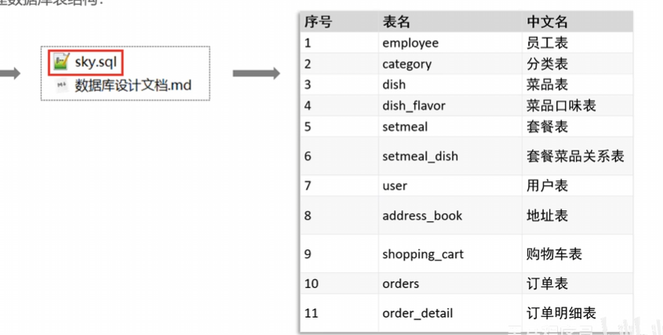
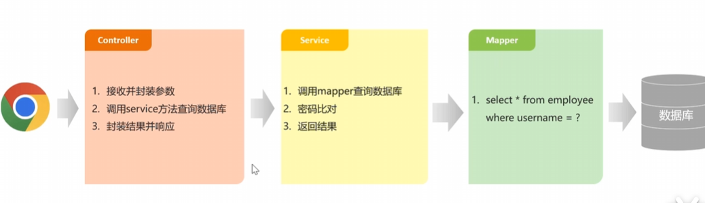
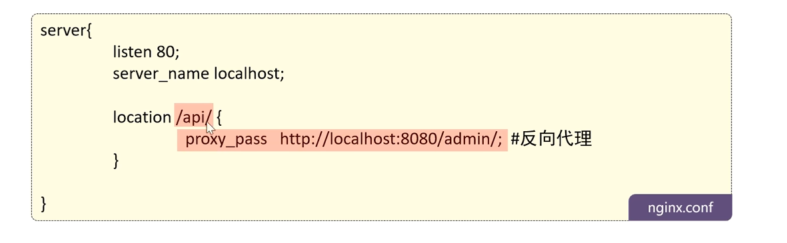
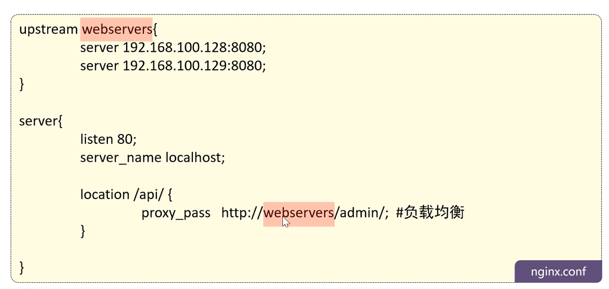
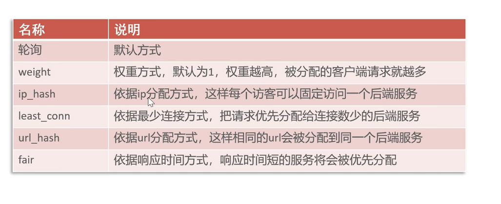
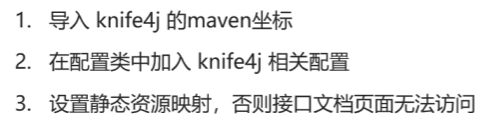
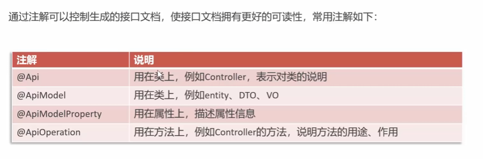

# 软件开发整体介绍
## 软件开发流程
 
## 角色分工

## 软件环境

 

# 苍穹外卖项目介绍

 

## 前端环境搭建
重点是后端，前端直接用 
后端搭建好框架，主要编写功能业务 
前端：管理端web 用户端小程序
后端：java服务框架
## 后端
后端使用maven
 

例如：DTO封装json成一个java
## 数据库设计
直接建表就行了
 

## 前后端联调

遇到一个编译失败问题：Class com.sun.tools.javac.tree.JCTree$JCImport does not have member field 'com.sun.tools.javac.tree.JCTree qualid'
 在依赖里升级了一下lom就好了
 
注解:相当于一个标签，告诉spring框架该类、接口、方法的信息，由框架统一管理
 
jwt:客户成功登陆后，服务端会生成一个令牌给客户端，客户端手持令牌才能访问服务端的资源，未成功返回或者令牌生命周期到期就无法访问
 
前端的请求怎么到后端？
前端的动态请求从nginx反向代理转发到后端服务器 

 
1. nginx可以做缓存，提高访问
2. 可以做负载均衡，将请求均匀合理分发发到后端服务器
3. 保证后端服务的安全，不暴露出来

**配置反向代理**：
在conf配置文件中配置 
 
将匹配到的部分给替换了
 
**负载均衡**：声明一个upstream转发 
 
**分配策略**：默认轮询（一人一个） 
 

# 完善登录功能
1. 明文密码要加密（md5加密）加密是不可逆的，只能单向加密 
1.1 修改数据库明文密码 
1.2 修改Java代码，把前端提交的加密 

# 导入接口文档
接口设计是个很复杂的过程，项目选择直接给出接口，直接导入 
1. 了解前后端分离开发流程 
接口规定了前后端交互的流程，比如格式之类的
2. 导入接口 yapi
3. swagger测试接口 
Knife4j集成了swagger在Java中 
 

## swagger的常用注解
 
注意相应的注解放到相应的位置