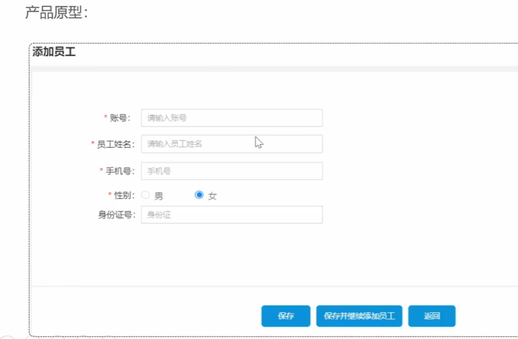

# 员工管理
## 新增员工
1. 需求分析设计：对着产品原型分析 
 
2. 思考一下表单上的限制 
账号唯一，手机号为11位合法，性别男女，身份证号18位（没设计注册，新增员工的密码默认为123456）
HTTP通过post请求利用json提供表单的内容 项目约定利用前缀分别用户端还是管理端
3. 使用dto封装一个前端的数据（前端提交的数据与实体类对应属性差的比较大，用dto）
4. 综合思路：使用一个dto来封装前端发的json文件，dto传入service层，service层使用一个实体来接收dto，并把实体写入持久层（数据库）
## 新增员工的功能测试
1. 接口文档测试，因为前后端联调不方便
2. 获取当前操作员的id，使用localthread的一个局部变量，每个线程共享一个
## 分页查询
根据页码展示员工信息，每页10条数据，接口提交页码，记录数，待查询员工姓名(不是必须)参数不是json 
 查询的返回pageresult，后面的业务统一